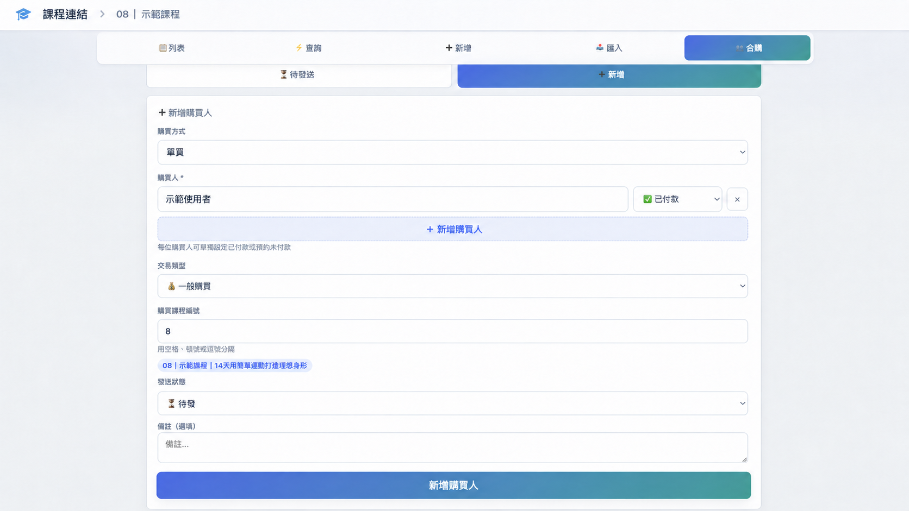

# 📚 課程連結管理

把分散的 YouTube、雲端載點與交換紀錄整理在同一個地方。  
網站支援課程查詢、批次匯入、單買、團購、跟團、交換課程，以及待發送進度管理。

👉 **開啟網站：[課程連結管理](https://aichi0121.github.io/my-courses/)**



> 圖片使用示範資料，實際畫面會顯示你自己的課程與紀錄。

## 第一次使用

1. 開啟網站。
2. 使用自己的 Google 帳號登入。
3. 到「新增」逐堂建立課程，或到「匯入」一次加入多堂課。
4. 完成後即可使用「列表」瀏覽課程，或使用「查詢」快速複製指定課程連結。
5. 若要管理購買、團購或交換紀錄，請進入「合購」。

每位使用者登入後會看到自己的資料，不需要共用課程清單或購買紀錄。

## 功能導覽

### 📋 列表

- 查看所有已建立的課程。
- 依編號、名稱或新增時間排序。
- 使用分類快速篩選。
- 搜尋課程名稱。
- 個別複製 YouTube 或雲端載點。
- 一鍵複製單堂課程的完整資訊。
- 編輯或刪除課程。

若課程尚未加入任何連結，系統會顯示「尚無連結」提醒。

### ⚡ 查詢

需要一次傳送多堂課時，可以直接輸入課程編號：

```text
01 09 28
```

也可以使用空格、逗號或頓號分隔。查詢結果會列出對應課程，並提供：

- 個別複製連結。
- 複製單堂課程全部資訊。
- 一鍵複製所有查詢結果。
- 提醒找不到或尚未建立連結的課程。

### ➕ 新增課程

可建立一般課程或直播課，內容包含：

- 課程名稱。
- 一個或多個 YouTube 連結。
- 雲端載點。
- 課程分類。
- 備註。
- 直播小課與各自的連結。

建議把課程編號放在名稱最前方，例如：

```text
08｜示範課程
```

「查詢」與「合購」會使用開頭的數字辨識課程。

### 📥 批次匯入

如果已有課程清單，可以一次貼上多堂課。每堂課之間空一行：

```text
08｜示範課程
YT：https://www.youtube.com/...
載點：https://example.com/...

09｜另一堂課
YT（完整播放清單）：https://www.youtube.com/...
載點：https://example.com/...
```

操作順序：

1. 選擇統一分類（選填）。
2. 貼上課程資料。
3. 按「預覽解析」確認內容。
4. 按「確認匯入」完成建立。

## 👥 合購與交換管理

「合購」分為「待發送」與「新增」兩個主要區域。

### 新增購買人

購買方式可選擇：

| 購買方式 | 適用情況 |
| --- | --- |
| 單買 | 一位購買人單獨購買課程 |
| 團購 | 多位購買人參加同一個團 |
| 跟團 | 你參加別人開的團 |

一般購買可設定：

- 購買人姓名或暱稱。
- 已付款／預約未付款。
- 課程編號。
- 待發／已發。
- 備註。

同一次新增可以加入多位購買人，每位購買人都能有自己的付款狀態。

### 🔄 交換課程

交換紀錄分成兩個方向：

- **藍色「收」**：對方給我的課程，可標記待收或已收到。
- **橘色「發」**：我給對方的課程，可標記待發或已發。

當我方課程已經有連結時，可使用「複製並標記已發」。  
系統會複製課程資訊並同步更新發送狀態。

### 👥 團購

團購會集中顯示在「團購」分頁，不會重複出現在全部、已付款或預約未付款。

建議流程：

1. 建立團購名稱。
2. 加入購買人並設定付款狀態。
3. 輸入團購課程編號。
4. 等待課程建立完成並加入連結。
5. 按「複製團購連結」。
6. 系統標記為已發，並把完成的團購移至「已完成」。

若仍有人預約未付款，系統會先顯示提醒，避免太早發送。

### 🗂 跟團

用來記錄你向其他人取得的課程：

- 對方名稱。
- 跟團名稱。
- 我是否已付款。
- 課程編號。
- 是否已取得課程。

### ✅ 待發送與已完成

可使用下列分頁整理紀錄：

- 全部。
- 已付款。
- 預約未付款。
- 交換。
- 跟團。
- 團購。
- 已完成。

一般購買可在新增或編輯時直接設定「待發／已發」，也可以建立後逐堂勾選。  
每一次購買紀錄都能單獨編輯或移除，不會因此刪除整位購買人。

## 常見問題

### 為什麼輸入編號後找不到課程？

課程名稱需要以數字開頭，例如 `08｜示範課程`。  
輸入 `8` 或 `08` 都能辨識同一個課程。

### 為什麼無法複製發送？

請先確認：

- 課程已經存在。
- 課程已加入 YouTube 或雲端載點。
- 團購沒有尚未付款的成員。

### 「移除此筆」和刪除購買人有什麼不同？

- 「移除此筆」只刪除某一次購買，其他紀錄與購買人會保留。
- 購買人卡片右上角的垃圾桶會刪除整位購買人及其全部紀錄。

### 朋友登入後會看到我的資料嗎？

網站會依 Google 帳號的使用者 ID 分開儲存資料。正式開放使用時，網站管理者仍應確認 Firestore Security Rules 已限制每位使用者只能讀寫自己的資料。

### 網站會使用哪個 Firebase 額度？

所有使用者的操作會計入這個課程網站所連接的 Firebase 專案，不會使用其他 Firebase 專案的額度。

## 使用提醒

- 請勿將不應公開分享的私人或受限制連結提供給未授權的人。
- 刪除課程或購買紀錄前，請再次確認內容。
- 重要資料建議另外保留備份。
- 網站功能與畫面可能隨版本更新而調整。

## 技術資訊

- 單頁式 HTML、CSS、JavaScript。
- Google Firebase Authentication。
- Cloud Firestore。
- GitHub Pages。
- 響應式桌面與手機版面。

## 維護者

若遇到無法登入、資料沒有更新或版面異常，請在 GitHub Repository 建立 Issue，並附上：

1. 使用的裝置與瀏覽器。
2. 問題發生在哪個分頁。
3. 操作步驟。
4. 畫面截圖（請遮住私人姓名與課程連結）。

